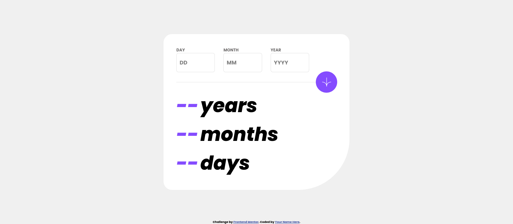
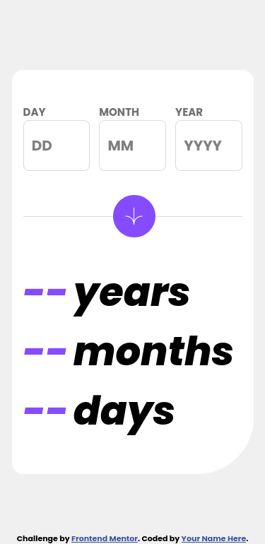
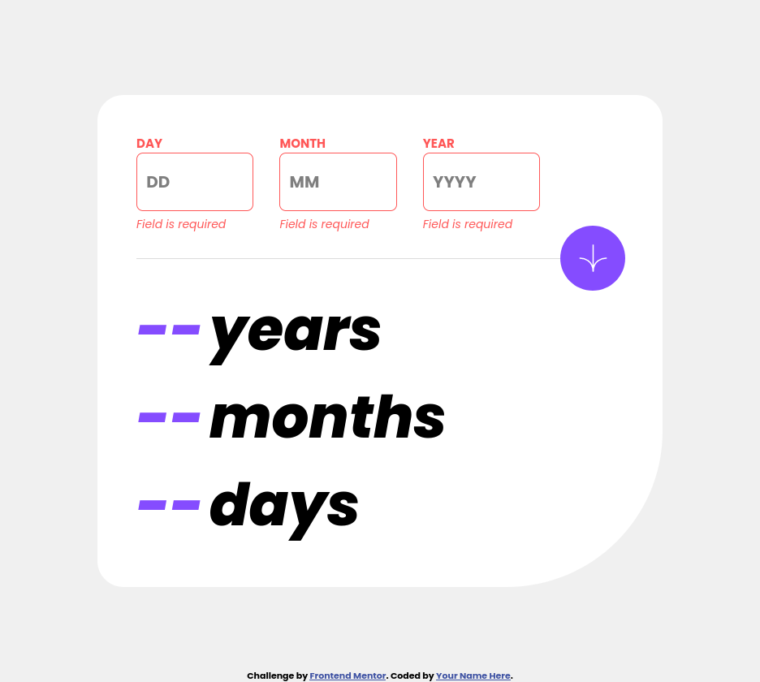

# Frontend Mentor - Age calculator app solution

This is a solution to the [Age calculator app challenge on Frontend Mentor](https://www.frontendmentor.io/challenges/age-calculator-app-dF9DFFpj-Q). Frontend Mentor challenges help you improve your coding skills by building realistic projects.

## Table of contents

-   [Overview](#overview)
    -   [The challenge](#the-challenge)
    -   [Screenshot](#screenshot)
    -   [Links](#links)
-   [My process](#my-process)
    -   [Built with](#built-with)
    -   [What I learned](#what-i-learned)
    -   [Continued development](#continued-development)
-   [Author](#author)

## Overview

### The challenge

Users should be able to:

-   View an age in years, months, and days after submitting a valid date through the form
-   Receive validation errors if:
    -   Any field is empty when the form is submitted
    -   The day number is not between 1-31
    -   The month number is not between 1-12
    -   The year is in the future
    -   The date is invalid e.g. 31/04/1991 (there are 30 days in April)
-   View the optimal layout for the interface depending on their device's screen size
-   See hover and focus states for all interactive elements on the page
-   **Bonus**: See the age numbers animate to their final number when the form is submitted

### Screenshot

-desktop view

-mobile view

-desktop active states

### Links

-   Solution URL: [Solution URL](https://github.com/vladius9512/FrontEndMentor-Challenges/tree/main/age-calculator-app-main)
-   Live Site URL: [Live Demo](hhttps://vladius9512.github.io/FrontEndMentor-Challenges/age-calculator-app-main/age.html)

## My process

-   First I made the HTMl elements and linked the css and js files to it.
-   Then I created the JS functions to get the input
-   I created a function to calculate the age
-   Created the DOM function to display the result.
-   Created the styling for the page, starting from the mobile view

### Built with

-   Semantic HTML5 markup
-   CSS custom properties
-   Flexbox

### What I learned

-   Getting to calculate the age was an interesting problem
-   Practice is good and you find new ways of testing stuff
-   The input type numbers allows you to enter letters on firefox
-   Date.parse() might work for an inexistent date depending on the browser you are using

### Continued development

-   I love practicing my HTML, CSS and JS on challenges from FrontEndMentor
-   I follow The Odin Project curriculum and plan to start the react part soon.
-   I test my problem solving skill on Codewars.

## Author

-   Frontend Mentor - [@vladius9512](https://www.frontendmentor.io/profile/vladius9512)
