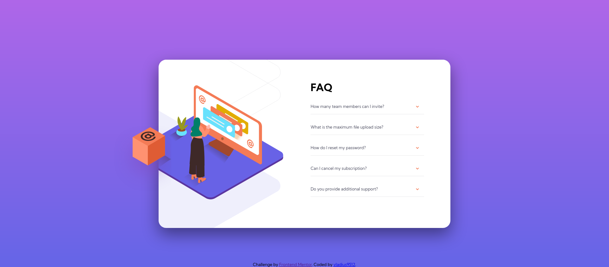
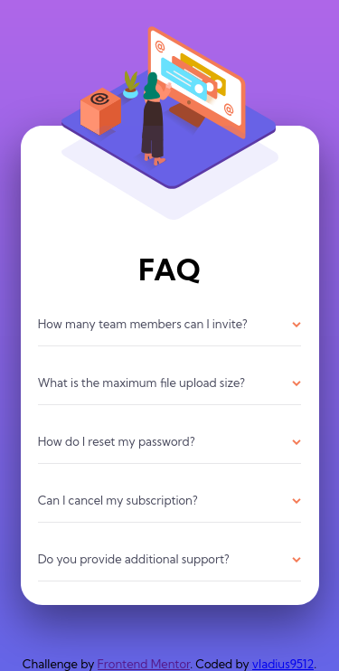

# Frontend Mentor - FAQ accordion card solution

This is a solution to the [FAQ accordion card challenge on Frontend Mentor](https://www.frontendmentor.io/challenges/faq-accordion-card-XlyjD0Oam). Frontend Mentor challenges help you improve your coding skills by building realistic projects.

## Table of contents

-   [Overview](#overview)
    -   [The challenge](#the-challenge)
    -   [Screenshot](#screenshot)
    -   [Links](#links)
-   [My process](#my-process)
    -   [Built with](#built-with)
    -   [What I learned](#what-i-learned)
    -   [Continued development](#continued-development)
    -   [Useful resources](#useful-resources)
-   [Author](#author)

## Overview

### The challenge

Users should be able to:

-   View the optimal layout for the component depending on their device's screen size
-   See hover states for all interactive elements on the page
-   Hide/Show the answer to a question when the question is clicked

### Screenshot

Desktop

Mobile

### Links

-   Solution URL: (https://github.com/vladius9512/FrontEndMentor-Challenges/tree/main/faq-accordion-card-main)
-   Live Site URL: (https://your-live-site-url.com)

## My process

-   First of all I filled in the HTML with the according elements.
-   Created the javascript and added the event listeners so that it works.
-   Started working on the styling, from mobile view all the way up to the desktop view.

### Built with

-   Semantic HTML5 markup
-   CSS custom properties
-   Flexbox
-   Mobile-first workflow

### What I learned

-   Actually this project was really helpfull. I never thought that its just an event listener with display:none.
-   Got some real practice with overflow and position: relative/absolute.
-   Practice, practice, practice

### Continued development

-   Improving my problem solving skills using codewars almost daily
-   Challenging myself and learning some nice designs using FronEndMentor
-   Following The Odin Project path for nice project ideas and a guide on what to learn next.

### Useful resources

-   [How to build an FAQ Page](https://sweetcode.io/how-to-build-an-faq-page-with-html-and-javascript/) - I first searched google for some ideas on a FAQ page, and this article helped me. As I said, once you find out how the magic is done, you realise is easier than you thought.

## Author

-   Frontend Mentor - [@vladius9512](https://www.frontendmentor.io/profile/vladius9512)
