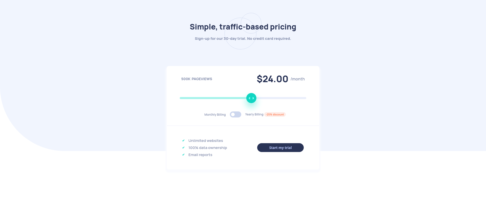
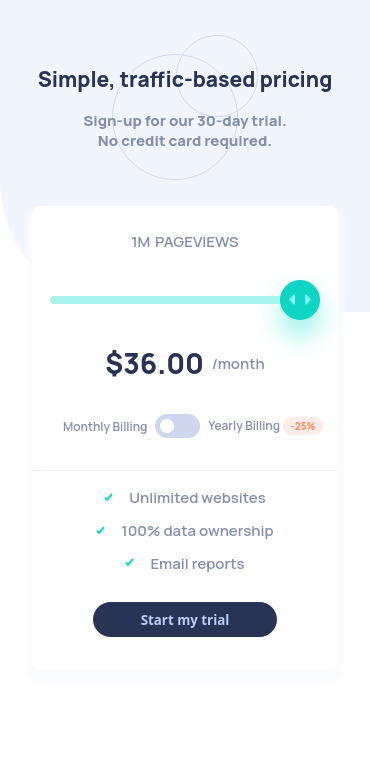

# Frontend Mentor - Interactive pricing component solution

This is a solution to the [Interactive pricing component challenge on Frontend Mentor](https://www.frontendmentor.io/challenges/interactive-pricing-component-t0m8PIyY8). Frontend Mentor challenges help you improve your coding skills by building realistic projects.

## Table of contents

-   [Overview](#overview)
    -   [The challenge](#the-challenge)
    -   [Screenshot](#screenshot)
    -   [Links](#links)
-   [My process](#my-process)
    -   [Built with](#built-with)
    -   [What I learned](#what-i-learned)
    -   [Continued development](#continued-development)
-   [Author](#author)

## Overview

### The challenge

Users should be able to:

-   View the optimal layout for the app depending on their device's screen size
-   See hover states for all interactive elements on the page
-   Use the slider and toggle to see prices for different page view numbers

### Screenshot

-   Desktop view

-   Mobile View

### Links

-   Solution URL: [Solution](https://github.com/vladius9512/FrontEndMentor-Challenges/tree/main/interactive-pricing-component-main)
-   Live Site URL: [Live Demo](https://vladius9512.github.io/FrontEndMentor-Challenges/interactive-pricing-component-main/interactive-pricing.html)

## My process

### Built with

-   Semantic HTML5 markup
-   CSS custom properties
-   Flexbox
-   Mobile-first workflow

### What I learned

It was my first time working with an input type range (or at least styling one). Found out that the styling for this input is quite different based on the browser. Also, styling it for Chrome was a little harder than expected. In the end this was indeed a challenge and I had something to learn. Took a break from the project because of summer holiday, and after 3 weeks of break, I fixed the project in a couple of minutes, so a break sometimes helps.

### Continued development

-   I plan to copy as many designs as possible
-   I have a project idea in mind and I think that now I have the skills to at least start the project and work on it
-   I still learn React following The Odin Project

## Author

-   Github - [vladius9512](https://github.com/vladius9512)
-   Frontend Mentor - [@vladius9512](https://www.frontendmentor.io/profile/vladius9512)
