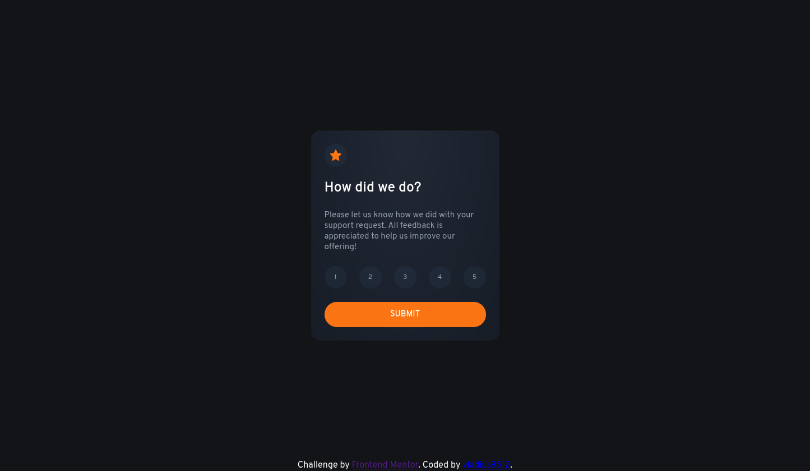
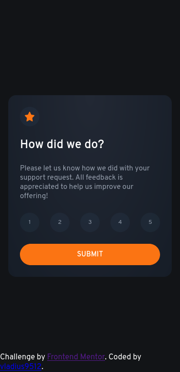

# Frontend Mentor - Interactive rating component solution

This is a solution to the [Interactive rating component challenge on Frontend Mentor](https://www.frontendmentor.io/challenges/interactive-rating-component-koxpeBUmI). Frontend Mentor challenges help you improve your coding skills by building realistic projects.

## Table of contents

-   [Overview](#overview)
    -   [The challenge](#the-challenge)
    -   [Screenshot](#screenshot)
    -   [Links](#links)
-   [My process](#my-process)
    -   [Built with](#built-with)
    -   [What I learned](#what-i-learned)
    -   [Continued development](#continued-development)
-   [Author](#author)

## Overview

### The challenge

Users should be able to:

-   View the optimal layout for the app depending on their device's screen size
-   See hover states for all interactive elements on the page
-   Select and submit a number rating
-   See the "Thank you" card state after submitting a rating

### Screenshot

-Desktop view

-Mobile view

### Links

-   Solution URL: (https://github.com/vladius9512/FrontEndMentor-Challenges/tree/main/interactive-rating-component-main)
-   Live Site URL: (https://your-live-site-url.com)

## My process

-   First of all, I created the elements inside the HTML, so I know what I want to have on the page.
-   Then I built the javascript, where I create all the elements in the HTML.
-   Create the logic, so the rating is saved and shown on the next page.
-   Complete the style as close to the design as possible.

### Built with

-   Semantic HTML5 markup
-   CSS custom properties
-   Flexbox
-   vanilla JS

### What I learned

-   Its always a good practice to do small challenges like this one. Especially on creating the elements inside the js and play with them.

### Continued development

-   I try to practice daily my coding.
-   Training my problem solving skills on codewars.
-   Practicing my HTML, CSS & JS with the help of FrontEndMentor and The Odin Project.

## Author

-   Github - [@vladius9512](https://github.com/vladius9512)
-   Frontend Mentor - [@vladius9512](https://www.frontendmentor.io/profile/vladius9512)
