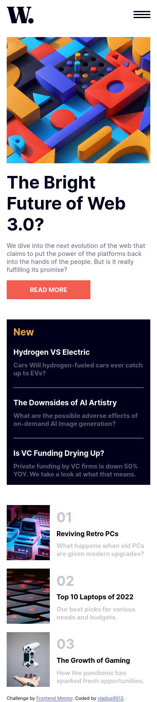

# Frontend Mentor - News homepage solution

This is a solution to the [News homepage challenge on Frontend Mentor](https://www.frontendmentor.io/challenges/news-homepage-H6SWTa1MFl). Frontend Mentor challenges help you improve your coding skills by building realistic projects.

## Table of contents

-   [Overview](#overview)
    -   [The challenge](#the-challenge)
    -   [Screenshot](#screenshot)
    -   [Links](#links)
-   [My process](#my-process)
    -   [Built with](#built-with)
    -   [What I learned](#what-i-learned)
    -   [Continued development](#continued-development)
-   [Author](#author)

## Overview

### The challenge

Users should be able to:

-   View the optimal layout for the interface depending on their device's screen size
-   See hover and focus states for all interactive elements on the page

### Screenshot

-desktop-view

-mobile-view

-mobile-menu-view

### Links

-   Solution URL: [Solution](https://github.com/vladius9512/FrontEndMentor-Challenges/tree/main/news-homepage-main)
-   Live Site URL: [Live Demo](https://vladius9512.github.io/FrontEndMentor-Challenges/news-homepage-main/newsHomepage.html)

## My process

-   Created the html elements and containers
-   Styled the basic mobile view and created the menu
-   Added the js functions so the menu is displayed on click
-   Finished the mobile view
-   Finished the desktop view and added the hover states.

### Built with

-   Semantic HTML5 markup
-   CSS custom properties
-   Flexbox
-   CSS Grid
-   Mobile-first workflow

### What I learned

-   Haven't practiced grid for a while, and it was a good reminder to use them again in a project.
-   First time I used img srcset and sizes. Its a real game changer now.

### Continued development

-   Trying to do as many frontEndMentor challenges as I can, to keep improving my HTML, CSS and JS solutions on building usefull components.
-   Doing codewars almost daily to work on my problem solving skills
-   Following The Odin Project curriculum

## Author

-   Frontend Mentor - [@vladius9512](https://www.frontendmentor.io/profile/vladius9512)
