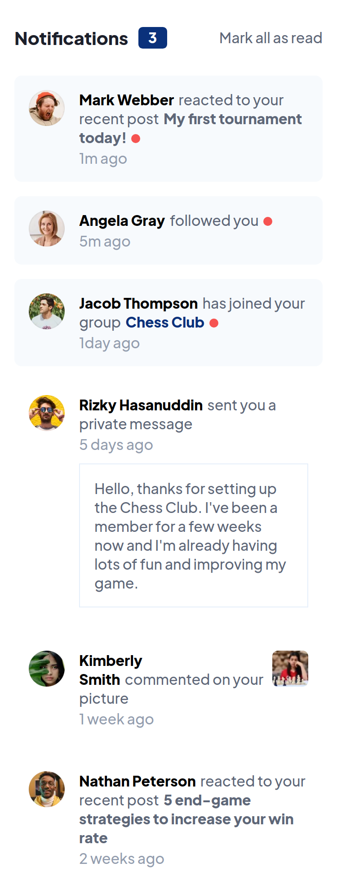

# Frontend Mentor - Notifications page solution

This is a solution to the [Notifications page challenge on Frontend Mentor](https://www.frontendmentor.io/challenges/notifications-page-DqK5QAmKbC). Frontend Mentor challenges help you improve your coding skills by building realistic projects.

## Table of contents

-   [Overview](#overview)
    -   [The challenge](#the-challenge)
    -   [Screenshot](#screenshot)
    -   [Links](#links)
-   [My process](#my-process)
    -   [Built with](#built-with)
    -   [What I learned](#what-i-learned)
-   [Author](#author)

## Overview

### The challenge

Users should be able to:

-   Distinguish between "unread" and "read" notifications
-   Select "Mark all as read" to toggle the visual state of the unread notifications and set the number of unread messages to zero
-   View the optimal layout for the interface depending on their device's screen size
-   See hover and focus states for all interactive elements on the page

### Screenshot

Mobile View

Desktop View

### Links

-   Solution URL: [Add solution URL here](https://github.com/vladius9512/FrontEndMentor-Challenges/tree/main/notifications-page-main)
-   Live Site URL: [Add live site URL here](https://vladius9512.github.io/FrontEndMentor-Challenges/notifications-page-main/notification.html)

## My process

-   I started working on it and placed everything inside the HTML elements as in the design. After doing this, I realised that in a work place, you would want to have a function that builds the notification elements, so you dont do this every time for different projects. So I created a javascript function that creates notification components (probably using React would have been easier)
-   After finishing all the javascript functionalities, I worked on the styling starting from mobile view and then desktop-view.

### Built with

-   Semantic HTML5 markup
-   CSS custom properties
-   Flexbox
-   Grid
-   All the notification elements are built using JS

### What I learned

-   Even though I knew about :nth-child it was the first time I used it
-   I knew the difference between a span and a div, but it was the first time I had to use this while practicing

## Author

-   Website - [vladius9512](https://github.com/vladius9512)
-   Frontend Mentor - [vladius9512](https://www.frontendmentor.io/profile/vladius9512)
