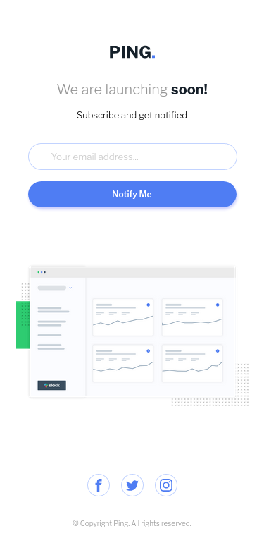

# Frontend Mentor - Ping coming soon page solution

This is a solution to the [Ping coming soon page challenge on Frontend Mentor](https://www.frontendmentor.io/challenges/ping-single-column-coming-soon-page-5cadd051fec04111f7b848da). Frontend Mentor challenges help you improve your coding skills by building realistic projects.

## Table of contents

-   [Overview](#overview)
    -   [The challenge](#the-challenge)
    -   [Screenshot](#screenshot)
    -   [Links](#links)
-   [My process](#my-process)
    -   [Built with](#built-with)
    -   [What I learned](#what-i-learned)
    -   [Continued development](#continued-development)
    -   [Useful resources](#useful-resources)
-   [Author](#author)

## Overview

### The challenge

Users should be able to:

-   View the optimal layout for the site depending on their device's screen size
-   See hover states for all interactive elements on the page
-   Submit their email address using an `input` field
-   Receive an error message when the `form` is submitted if:
    -   The `input` field is empty. The message for this error should say _"Whoops! It looks like you forgot to add your email"_
    -   The email address is not formatted correctly (i.e. a correct email address should have this structure: `name@host.tld`). The message for this error should say _"Please provide a valid email address"_

### Screenshot

-   Mobile view
    

-   Desktop view
    

### Links

-   Solution URL: [solution link](https://github.com/vladius9512/FrontEndMentor-Challenges/tree/main/ping-coming-soon-page-master)
-   Live Site URL: [Live demo](https://your-live-site-url.com)

## My process

-   Wrote the HTML code for the page
-   Wrote the javascript for the input and tested it to see if it works as intended
-   Started styling the page from the mobile view
-   Created the styling for the desktop view

### Built with

-   Semantic HTML5 markup
-   CSS custom properties
-   Flexbox
-   Mobile-first workflow

### What I learned

-   Practiced some more styling on the input and aria-describedby

### Continued development

-   I practice my problem solving skills and javascript using Codewars daily
-   I train my HTML, CSS and Javascript using FrontEndMentor
-   I follow The Odin Project curriculum so I have a better idea on what to learn next.

## Author

-   Frontend Mentor - [@vladius9512](https://www.frontendmentor.io/profile/vladius9512)
